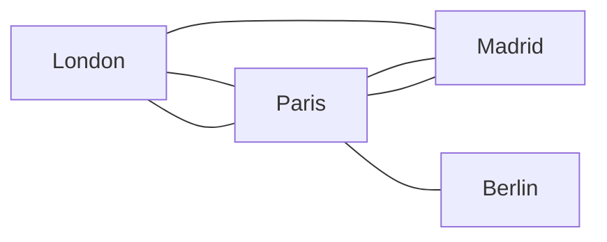
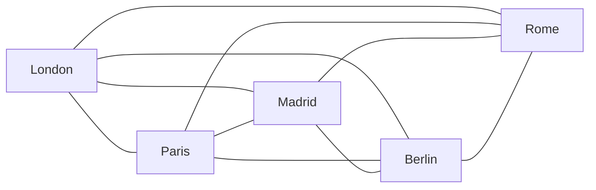

# Graph theory in Ticket to Ride

This article maps Ticket to Ride game mechanics to concepts of graph theory.

## What makes a valid game map

A game map in Ticket to Ride is a set of routes that connect a set of cities.
However, for it to make a valid playable game, it should adhere to some constraints.
On the other hard, some patterns that you typically don't see in popular Ticket to Ride editions are theoretically feasible,
in a sense that their introduction would not break the fundamentals of the game.

This package aims to address both groups of conditions:

* Those which violate game idea fundamentals are caught at map initialization stage automatically.
* Those which don't - made possible to model even if none of the physical game editions implement them.

### Constraints

This section outlines conditions which this package validates to initialize a game board.

#### No bridges

Imagine the following map:

What makes it incompatible with Ticket to Ride fundamental gameplay feature is that by **blocking a single route** (Paris-Berlin in this case),
one player may **completely block a city** (Berlin) for the rest of the game.

In graph theory terminology, this route between Paris and Berlin is called a **bridge**.
And what the package enforces is that **a map cannot have any bridges**.

!!! note "What is a bridge?"

    A **bridge** in a graph is an edge whose removal causes the number of connected components of the graph to increase[^1].

#### Planarity

A Ticket to Ride is a board game first of all, and its map should be possible to draw in 2D without routes intersecting.
In graph theory, exactly this property is called **planarity**.

!!! note "What is planarity?"

    A graph is called **planar** if and only if it can be drawn in a plane without any edge intersections.[^2].

The simplest example of a non-planar graph, and therefore an invalid game map is a set of **five** cities all directly connected to each other:

### Possibilities

Below are some patterns that you wouldn't find in physical Ticket to Ride distributions, but they are allowed in this package
as they do not violate game fundamentals.

* A pair of cities connected by more than two routes.
* Routes connecting a pair of cities have different lengths.
* A city has direct routes to all other cities on the map.

[^1]: *Source: [NetworkX documentation](https://networkx.org/documentation/stable/reference/algorithms/generated/networkx.algorithms.bridges.bridges.html#networkx.algorithms.bridges.bridges)*
[^2]: *Source: [NetworkX documentation](https://networkx.org/documentation/stable/reference/algorithms/generated/networkx.algorithms.planarity.check_planarity.html#networkx.algorithms.planarity.check_planarity)*